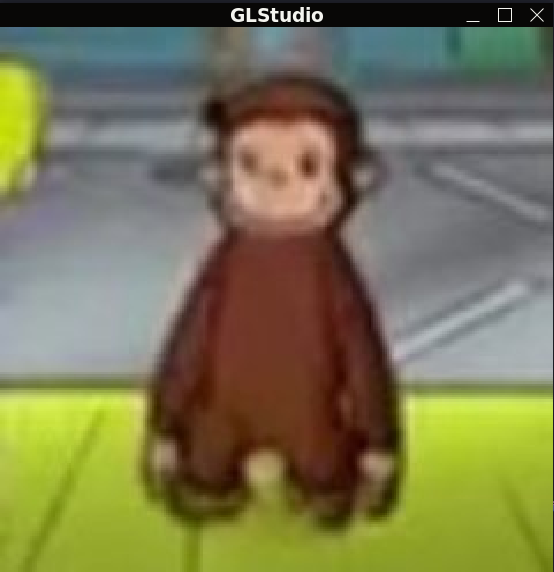
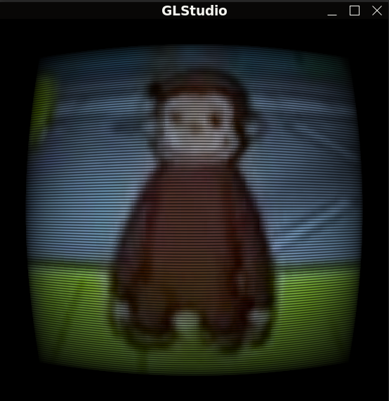
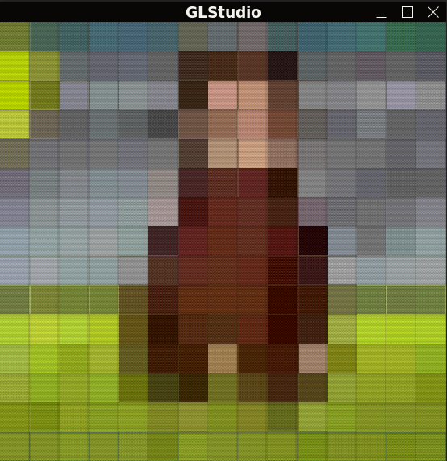

# GLStudio

A simple openGL-based image viewer with retro shader effects

## Screenshots
### Normal:

### CRT:

### Pixelation:

## Features
- load images
- apply real-time effects
  - normal
  - CRT effect with scanlines
  - Pixelation with dithering 
  
## Controls
- `0` - Normal view
- `1` - CRT effect
- `2` - Pixelation effect 
- `U` - Upload new image

## Building

Requires:
- OpenGL 
- GLFWL3
- GLAD 

download the pre-built version from [itch.io](https://shahd-moh-abdel.itch.io/glstudio) only works on linux (zenity for window dialog).

## what's next 

- window resizing is not properly handled yet, I plan to add aspect ratio preservation when I have time. 
- I plan to add imgui controls and more shader effects

